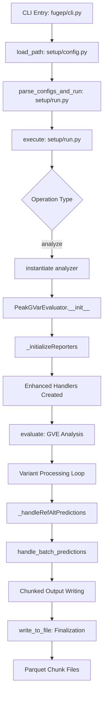

# FuGEP GVE Score Prediction and Output Handling - Complete Execution Flow

## Overview

This document describes the complete execution flow for **Genetic Variant Effect (GVE) score prediction** in FuGEP, from CLI entry point to final output file generation. The flow shows how `mean_gve` and `pval` scores are calculated and saved using the new enhanced chunked parquet output system.

---

## 🚀 **Execution Flow Diagram**



---

## 📂 **Detailed Step-by-Step Execution**

### **Step 1: CLI Entry Point**
**File:** `fugep/cli.py`
```python
@click.command()
def main(path):
    """Build the model and trains it using user-specified input data."""
    configs = load_path(path, instantiate=False)      # ← Load YAML config
    parse_configs_and_run(configs)                    # ← Start execution
```

**Input:** YAML configuration file
**Output:** Parsed configuration dictionary

---

### **Step 2: Configuration Loading**
**File:** `fugep/setup/config.py`
```python
def load_path(path, environ=None, instantiate=False, **kwargs):
    # Loads and validates YAML configuration
    # Returns parsed config dictionary
```

**Key Config Sections:**
- `ops: ["analyze"]` - Operation type
- `analyzer:` - Analysis configuration
- `variant_effect_prediction:` - GVE specific settings
- `output_format: "parquet"` - Output format

---

### **Step 3: Main Execution Router**
**File:** `fugep/setup/run.py`
```python
def parse_configs_and_run(configs):
    # Sets up output directories, random seeds
    execute(configs)                                  # ← Route to execution

def execute(configs):
    for op in configs['ops']:
        if op == "analyze":                           # ← GVE analysis branch
            analyze_seqs_info = configs["analyzer"]
            analyze_seqs = instantiate(analyze_seqs_info)    # ← Create analyzer
            
            if "variant_effect_prediction" in configs:
                analyze_seqs.evaluate()               # ← Start GVE evaluation
```

**Decision Point:** Routes to GVE analysis based on config

---

### **Step 4: GVE Analyzer Initialization**
**File:** `fugep/predict/seq_ana/gve/peak.py`
```python
class PeakGVarEvaluator(GVarEvaluator):
    def __init__(self, analysis, model, features, vcfFile, outputFormat='parquet', ...):
        super().__init__(...)
        
        # Load variants from VCF file
        self._variants = read_vcf_file(self._vcfFile, ...)
        
        # Initialize output handlers
        self._reporters = self._initializeReporters(
            self._outputPathPrefix,
            self.VARIANTEFFECT_COLS,
            self._model._mult_predictions, 
            save_mult_pred,
            outputSize=len(self._variants),
            outputFormat=self._outputFormat
        )
```

**Key Operations:**
- Loads VCF variants into memory
- Initializes enhanced output handlers
- Sets up batch processing parameters

---

### **Step 5: Enhanced Handler Creation**
**File:** `fugep/predict/analyzer.py`
```python
def _initializeReporters(self, outputPath, colNamesOfIds, mult_predictions, 
                        save_mult_pred, outputSize, outputFormat=None, analysis=None):
    
    enhanced_args = {
        'features': self._features,
        'columns_for_ids': colNamesOfIds,
        'output_path_prefix': outputPath,
        'mult_predictions': mult_predictions,
        'save_mult_pred': save_mult_pred,
        'output_format': outputFormat,              # 'parquet'
        'output_size': outputSize,
        'write_mem_limit': self._writeMemLimit // len(analysis),
        'data_type_config': 'production'            # Optimal data types (50% memory savings)
    }
    
    reporters = []
    for s in analysis:  # e.g., ["mean_gve", "pval"]
        if "mean_gve" == s:
            reporters.append(create_mean_gve_handler(**enhanced_args))    # ← Enhanced handler
        elif "pval" == s:
            reporters.append(create_pval_handler(**enhanced_args))        # ← Enhanced handler
```

**Handler Types Created:**
- **EnhancedMeanGVEHandler** with ParquetBackend
- **EnhancedPvalHandler** with ParquetBackend
- Memory limit split across handlers
- Chunked output (no merging)

---

### **Step 6: GVE Evaluation Main Loop**
**File:** `fugep/predict/seq_ana/gve/peak.py`
```python
def evaluate(self, inputData=None):
    """Get model predictions and scores for variants."""
    
    # Process variants in batches
    for ix in range(0, len(self._variants), self._batchSize):
        batch_variants = self._variants[ix:ix + self._batchSize]
        
        # Extract sequences and create batch
        batchRefSeqs, batchAltSeqs, batchIds = self._getBatchSeqs(batch_variants)
        
        # Get model predictions and calculate GVE scores
        self._handleRefAltPredictions(batchRefSeqs, batchAltSeqs, batchIds)
    
    # Finalize all handlers
    for r in self._reporters:
        r.write_to_file()                           # ← Write final chunks
```

**Batch Processing:**
- Processes variants in configurable batch sizes
- Extracts reference and alternate sequences
- Calculates predictions and scores
- Handles memory management

---

### **Step 7: Prediction Processing**
**File:** `fugep/predict/seq_ana/gve/peak.py`
```python
def _handleRefAltPredictions(self, batchRefSeqs, batchAltSeqs, batchIds):
    """Handle predictions for reference and alternate sequences."""
    
    n_pred = self._model._mult_predictions
    
    if n_pred > 1:
        # Multiple predictions per variant (for p-value calculation)
        outputs = self._model.predict_mult([{'sequence': batchSeqs}])
        refOutputs = outputs[:, :batchRefSeqs.shape[0], :]
        altOutputs = outputs[:, batchAltSeqs.shape[0]:, :]
        
        for r in self._reporters:
            if r.needs_base_pred:
                r.handle_batch_mult_predictions(altOutputs, batchIds, refOutputs)  # ← P-values
            else:
                r.handle_batch_mult_predictions(altOutputs, batchIds)
    else:
        # Single prediction per variant (for mean GVE calculation)
        refOutputs = self._model.predict([{'sequence': batchRefSeqs}])
        altOutputs = self._model.predict([{'sequence': batchAltSeqs}])
        
        for r in self._reporters:
            if r.needs_base_pred:
                r.handle_batch_predictions(altOutputs, batchIds, refOutputs)      # ← Mean GVE
            else:
                r.handle_batch_predictions(altOutputs, batchIds)
```

**Prediction Flow:**
- **Multiple predictions → P-value calculation** (statistical significance)
- **Single predictions → Mean GVE calculation** (effect magnitude)
- Routes to appropriate handler methods

---

### **Step 8: Mean GVE Score Calculation**
**File:** `fugep/predict/ana_hdl/enhanced_mean_gve_handler.py`
```python
def handle_batch_predictions(self, batch_predictions, batch_ids, baseline_predictions):
    """Calculate mean GVE for a batch and store results."""
    
    # Calculate absolute differences between variant and reference predictions
    absolute_diffs = np.abs(baseline_predictions[0] - batch_predictions[0])
    
    results = []
    for i, variant_id in enumerate(batch_ids):
        gve_values = absolute_diffs[i]
        
        # If multiple predictions, average them
        if len(gve_values.shape) > 1:
            gve_mean = np.mean(gve_values, axis=0)
        else:
            gve_mean = gve_values
        
        # Create result row: [variant_id, gve_feat1, gve_feat2, ...]
        result_row = [variant_id] + gve_mean.tolist()
        results.append(result_row)
    
    # Store using backend system (triggers chunking if memory limit reached)
    if self._backend:
        self._backend.add_results(results, batch_ids)     # ← Chunked storage
```

**GVE Calculation:**
- **GVE = |Reference_Prediction - Variant_Prediction|**
- One score per feature per variant
- Automatic chunking when memory limit reached

---

### **Step 9: P-value Calculation**
**File:** `fugep/predict/ana_hdl/enhanced_pval_handler.py`
```python
def handle_batch_mult_predictions(self, batch_predictions, batch_ids, baseline_predictions):
    """Calculate p-values for multiple predictions per variant."""
    
    # Calculate differences: baseline - variant predictions
    diffs = baseline_predictions - batch_predictions
    
    # Perform t-test across multiple predictions (axis=0)
    _, pvals = stats.ttest_1samp(diffs, 0, axis=0)     # ← Statistical test
    
    results = []
    for i, variant_id in enumerate(batch_ids):
        # All variants get same p-values (computed across all predictions)
        pvals_list = pvals.tolist() if hasattr(pvals, 'tolist') else list(pvals)
        result_row = [variant_id] + pvals_list
        results.append(result_row)
    
    # Store using backend system
    if self._backend:
        self._backend.add_results(results, batch_ids)     # ← Chunked storage
```

**P-value Calculation:**
- **Statistical significance test** across multiple predictions
- **One-sample t-test** against zero difference
- One p-value per feature (not per variant)

---

### **Step 10: Chunked Parquet Output**
**File:** `fugep/predict/ana_hdl/output_backends.py`
```python
class ParquetBackend(OutputBackend):
    def add_results(self, results, ids):
        """Add results and check if chunk writing is needed."""
        self._results.extend(results)
        self._all_ids.extend(ids)
        
        # Check memory limit (estimate 8 bytes per float)
        if len(self._results) * len(self.features) * 8 >= self.write_mem_limit * 1024 * 1024:
            self._write_current_chunk()                   # ← Write chunk when limit reached
    
    def write_chunk(self, results, chunk_id):
        """Write results chunk to parquet file."""
        columns = self.columns_for_ids + list(self.features)
        df = pd.DataFrame(results, columns=columns)
        
        chunk_path = f"{self.output_path_prefix}_chunk_{chunk_id:06d}.parquet"
        df.to_parquet(chunk_path, index=False)            # ← Parquet file creation
        
        return chunk_path
```

**Chunking Strategy:**
- **Memory-based chunking**: Write when memory limit reached
- **Sequential naming**: `output_chunk_000001.parquet`, `output_chunk_000002.parquet`, etc.
- **No merging**: Keep chunks separate for efficient column-wise access

---

### **Step 11: Final Output Generation**
**File:** `fugep/predict/ana_hdl/enhanced_*_handler.py`
```python
def write_to_file(self, close_filehandle=True):
    """Write remaining results and finalize output."""
    
    if self._backend:
        # Write any remaining results as final chunk
        output_path = self._backend.finalize()
        
        print(f"Kept {len(self._chunk_files)} chunk files for efficient column-wise access:")
        for chunk_file in self._chunk_files:
            print(f"  {chunk_file}")
        print(f"For column-wise operations, use: pd.read_parquet('prefix_chunk_*.parquet', columns=['col1', 'col2'])")
```

**Final Output:**
- **Multiple parquet chunk files** (not merged)
- **Efficient column-wise access** for downstream analysis
- **Memory-efficient processing** of TB-scale datasets

---

## 📊 **Output File Structure**

### **Mean GVE Output Files:**
```
output_mean_gve_chunk_000001.parquet  # ~10GB
output_mean_gve_chunk_000002.parquet  # ~10GB
...
output_mean_gve_chunk_002000.parquet  # ~10GB
Total: ~20TB across 2000 files
```

### **P-value Output Files:**
```
output_pval_chunk_000001.parquet      # ~10GB  
output_pval_chunk_000002.parquet      # ~10GB
...
output_pval_chunk_002000.parquet      # ~10GB
Total: ~20TB across 2000 files
```

### **File Content Structure:**
```python
# Mean GVE chunks
columns = ['variant_id', 'feature1_gve', 'feature2_gve', ..., 'featureN_gve']

# P-value chunks  
columns = ['variant_id', 'feature1_pval', 'feature2_pval', ..., 'featureN_pval']
```

---

## 🔧 **Configuration Example**

```yaml
# config.yml
ops: ["analyze"]
output_dir: "/path/to/output"
output_format: "parquet"

analyzer:
  class_name: "PeakGVarEvaluator"
  analysis: ["mean_gve", "pval"]
  vcfFile: "/path/to/variants.vcf"
  features: ["feature1", "feature2", "feature3"]
  writeMemLimit: 10000  # 10GB per handler (20GB total)
  batchSize: 1000

model:
  class_name: "PeakModel"
  trainedModelPath: "/path/to/model.pth"

variant_effect_prediction: {}
```

---

## 🚀 **Performance Characteristics**

| Aspect | Value |
|--------|--------|
| **Input Data** | VCF file with millions of variants |
| **Memory Usage** | ~20GB peak (10GB per handler) |
| **Output Size** | ~40TB total (20TB mean_gve + 20TB pval) |
| **Chunk Size** | ~10GB per chunk file |
| **Total Chunks** | ~4000 files (2000 per analysis type) |
| **Access Pattern** | Column-wise efficient with parquet |
| **Compression** | Built-in parquet compression (~50% space saving) |

---

## 🔍 **Key Benefits**

1. **Memory Efficiency**: Fixed memory usage regardless of dataset size
2. **Scalability**: Handles TB-scale genomics datasets  
3. **Column Access**: Fast feature-specific queries
4. **Parallel Processing**: Each chunk can be processed independently
5. **Storage Efficiency**: Parquet compression reduces file sizes
6. **Fault Tolerance**: Partial results preserved if process interrupted

---

## 📈 **Usage Examples**

### **Read Specific Features:**
```python
import pandas as pd

# Read only specific features from all chunks
df = pd.read_parquet(
    'output_mean_gve_chunk_*.parquet', 
    columns=['variant_id', 'feature1_gve', 'feature5_gve']
)
```

### **Process Chunks Individually:**
```python
import glob

chunk_files = glob.glob('output_mean_gve_chunk_*.parquet')
for chunk_file in chunk_files:
    chunk_df = pd.read_parquet(chunk_file)
    # Process chunk independently
    process_chunk(chunk_df)
```

This execution flow ensures efficient processing and storage of large-scale genomic variant effect data while maintaining computational feasibility and storage practicality.
